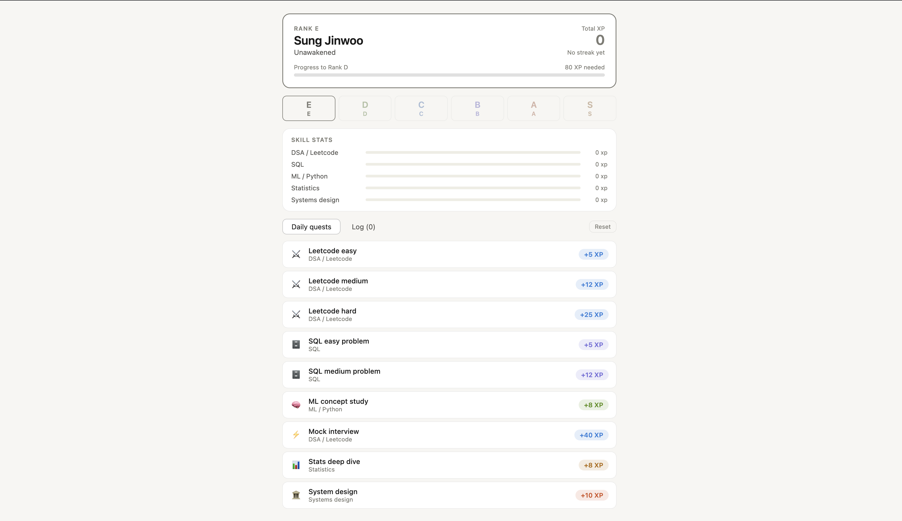
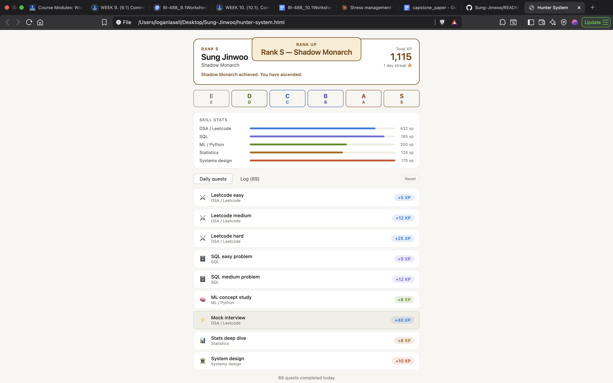

# Want to join the Hunt against Comp Sci's most difficult issues?


## Level up your CS skills and keep track through this Hunter Enhancement System!

# Base Hunter


## Current Quest Types
### Leetcode Problems
- Easy
- Medium
- Hard
### SQL Problems
- Easy
- Medium
### Machine Learning Concept Study
- ML Concepts
- Python Concepts
### Mock Interview
- Data Structures
- Algorithms
- Leetcode Interview Problems
### Stats Deep Dive
### System Design Concepts

# Shadow Monarch Hunter


# Are you Ready Hunter?


#### *Dev note: You can customize your Hunter name in the HTML file provided.*
#### *In this block of code, at the line labeled: ENTER YOUR HUNTER NAME*
```
let html = `
    <div class="hunter-card" style="--rank-color:${rank.color}; border-color:${rank.color}">
      <div class="hunter-top">
        <div>
          <div class="rank-label">Rank ${rank.rank}</div>
          <div class="hunter-name">ENTER YOUR HUNTER NAME</div>
          <div class="rank-title">${rank.label}</div>
        </div>
        <div class="xp-block">
          <div class="xp-label">Total XP</div>
          <div class="xp-value" style="color:${rank.color}">${state.totalXp.toLocaleString()}</div>
          <div class="streak">${state.streak > 0 ? state.streak + " day streak 🔥" : "No streak yet"}</div>
        </div>
      </div>
```

